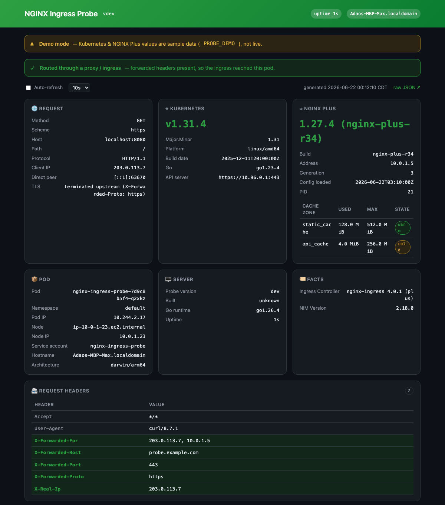

# nginx-ingress-probe

A tiny diagnostics page to **verify an NGINX (Plus) ingress after an upgrade**. Deploy it
behind your ingress, open it, and it shows — on one beautiful page — the request the ingress
forwarded, the Kubernetes version, and (when pointed at the NGINX Plus API) the nginx version,
build, and cache zones. One static Go binary, standard library only, distroless and non-root.




## What it shows

- **Request through the ingress** — every header (so the NGINX Plus `X-Forwarded-*` / real-IP
  injections are visible and highlighted), scheme, client-IP chain, TLS. A green banner confirms
  the request actually arrived via a proxy/ingress.
- **Kubernetes** — the cluster version (queried from the in-cluster API `/version`), plus the
  pod, namespace, node, and IPs from the downward API.
- **NGINX Plus** — set `NGINX_PLUS_API_URL` and it pulls `/nginx` (version, build, generation,
  PID) and `/http/caches` (cache zone names, used vs. max size, cold/warm).
- **Facts** — any `PROBE_FACT_*` env var, for things the data-plane API doesn't expose
  (NGINX Instance Manager version, controller version, …).

Endpoints: **`/`** (the page) · **`/api/info`** (everything as JSON, great for `curl`) ·
**`/healthz`**.

## Deploy

```bash
kubectl apply -f https://raw.githubusercontent.com/junior/nginx-ingress-probe/main/k8s/deployment.yaml
kubectl apply -f https://raw.githubusercontent.com/junior/nginx-ingress-probe/main/k8s/service.yaml
kubectl apply -f https://raw.githubusercontent.com/junior/nginx-ingress-probe/main/k8s/ingress.yaml
```

The Ingress uses the cluster's **default IngressClass** (edit `k8s/ingress.yaml` to set a host
or an explicit `ingressClassName`). Then browse the host — or, quickly, without an ingress:

```bash
kubectl port-forward deploy/nginx-ingress-probe 8080:8080   # → http://localhost:8080
```

### Show the NGINX Plus data

Point the probe at the controller's NGINX Plus API (uncomment in `k8s/deployment.yaml`):

```yaml
- name: NGINX_PLUS_API_URL
  value: "http://nginx-ingress.nginx-ingress.svc:8080/api"
```

## Run locally

```bash
docker run --rm -p 8080:8080 ghcr.io/junior/nginx-ingress-probe
# preview the full UI without a cluster (sample Kubernetes/NGINX Plus values):
docker run --rm -p 8080:8080 -e PROBE_DEMO=1 ghcr.io/junior/nginx-ingress-probe
```

## Configuration

| Variable | Default | Purpose |
|----------|---------|---------|
| `PORT` | `8080` | listen port |
| `NGINX_PLUS_API_URL` | — | NGINX Plus API base; enables the version + cache-zone card |
| `NGINX_PLUS_API_INSECURE` | `false` | skip TLS verification for a self-signed Plus API |
| `PROBE_FACT_*` | — | each becomes a row in the **Facts** card (e.g. `PROBE_FACT_NIM_Version`) |
| `PROBE_DEMO` | `false` | fill sample K8s/Plus values for local previews (clearly flagged) |

Pod identity (`POD_NAME`, `POD_NAMESPACE`, `POD_IP`, `NODE_NAME`, `HOST_IP`,
`POD_SERVICE_ACCOUNT`) is wired from the Kubernetes downward API in the Deployment.

## Security

Single static binary on `distroless/static:nonroot` — runs as **uid 65532**, **read-only root
filesystem**, **all capabilities dropped**, `RuntimeDefault` seccomp, no shell. The cluster
version uses the pod's service-account token against `/version` (readable by any authenticated
account — no extra RBAC).

## Develop

```bash
go run .              # → http://localhost:8080  (try PROBE_DEMO=1)
go test ./...
go vet ./... && gofmt -l .
```

## Releasing

Images publish to **GHCR** via [`.github/workflows/release.yml`](.github/workflows/release.yml)
— multi-platform (`linux/amd64`, `linux/arm64`), tagged `latest` + the semver version:

```bash
git tag v1.0.0 && git push origin v1.0.0
```

## License

[MIT](LICENSE).
